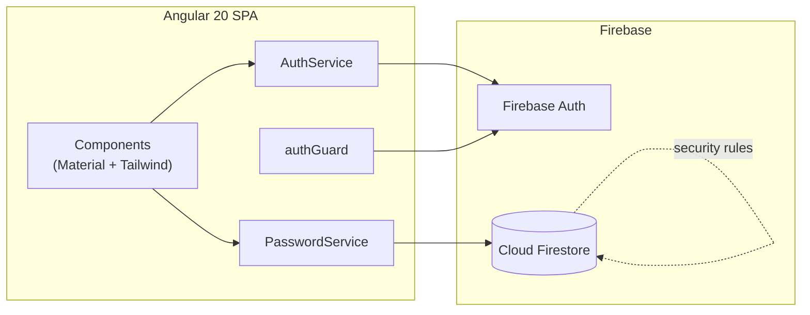

# Password Manager — Web App Plan

> Planning document for a web application to manage passwords, built with **Angular 20**, **Tailwind CSS**, **Angular Material**, and **Firebase**.

---

## 1. Overview

A single-page web application that lets a user **register**, **log in**, and manage
their own set of password entries (**Create / Read / Update / Delete**). Each entry
stores the website, a password, and optionally an email and a username. Data is
scoped per user and persisted in **Cloud Firestore**, with authentication handled by
**Firebase Authentication**.

### Scope

| In scope | Out of scope |
| --- | --- |
| Email/password account registration | Social / OAuth login (Google, GitHub, …) |
| Email/password login + logout | Password recovery / reset flow (optional, phase 2) |
| CRUD for password entries | Sharing entries between users |
| Per-user data isolation (Firestore rules) | Browser extension / autofill |
| Responsive UI (Tailwind + Material) | **Unit tests (explicitly excluded)** |

---

## 2. Tech Stack

| Layer | Technology | Notes |
| --- | --- | --- |
| Framework | **Angular 20** | Standalone components, signals, new control flow (`@if` / `@for`) |
| Styling (utility) | **Tailwind CSS** | Layout, spacing, responsive utilities |
| UI components | **Angular Material** | Form fields, buttons, dialogs, table/cards, snackbars |
| Backend / Auth | **Firebase Authentication** | Email + password provider |
| Database | **Cloud Firestore** | Per-user password documents |
| Firebase SDK | **@angular/fire** | Official Angular bindings for Firebase |
| Hosting (optional) | **Firebase Hosting** | Deploy target |

> **No unit tests** are included in this plan per project requirements.

---

## 3. Functional Requirements

### 3.1 Authentication

- **Register account** — email + password. On success, the user is signed in and
  redirected to the passwords list.
- **Login** — email + password. On success, redirect to the passwords list.
- **Logout** — clears the session and returns to the login screen.
- Auth state persists across page reloads (Firebase default local persistence).

### 3.2 Password CRUD

A password entry has four fields:

| Field | Required | Type | Validation |
| --- | --- | --- | --- |
| `web` | ✅ **Yes** | text | Non-empty |
| `password` | ✅ **Yes** | text | Non-empty |
| `email` | ⬜ No | text | Valid email format *if provided* |
| `username` | ⬜ No | text | — |

Operations:

- **Create** — add a new entry (dialog/form). `web` and `password` are mandatory.
- **Read** — list all entries belonging to the signed-in user.
- **Update** — edit an existing entry.
- **Delete** — remove an entry (with a confirmation prompt).
- **Reveal / copy** — toggle password visibility and copy to clipboard (UX nicety).

---

## 4. Data Model

Entries are stored as a **subcollection under each user**, which makes per-user
isolation trivial in the security rules:

```
users/{uid}/passwords/{passwordId}
```

### `PasswordEntry` model

```typescript
import { Timestamp } from '@angular/fire/firestore';

export interface PasswordEntry {
  id?: string;         // Firestore document id (client-side only)
  web: string;         // mandatory
  password: string;    // mandatory
  email?: string;      // optional
  username?: string;   // optional
  createdAt: Timestamp;
  updatedAt: Timestamp;
}
```

> The `uid` is implied by the document path (`users/{uid}/passwords`), so it does not
> need to be stored on the document itself.

---

## 5. Architecture



- **Standalone components** everywhere (no `NgModule`).
- **Signals** for local/component state; `@angular/fire` observables bridged with
  `toSignal` where convenient.
- **Functional providers** (`provideRouter`, `provideFirebaseApp`, …) in `app.config.ts`.
- **Functional route guard** (`CanActivateFn`) protects authenticated routes.

### Project structure

```
src/
├── app/
│   ├── app.config.ts            # providers (router, firebase, animations)
│   ├── app.routes.ts            # route table
│   ├── app.component.ts         # root shell (toolbar + <router-outlet>)
│   │
│   ├── core/
│   │   ├── guards/
│   │   │   └── auth.guard.ts
│   │   ├── models/
│   │   │   └── password-entry.model.ts
│   │   └── services/
│   │       ├── auth.service.ts
│   │       └── password.service.ts
│   │
│   ├── features/
│   │   ├── auth/
│   │   │   ├── login/           # login.component
│   │   │   └── register/        # register.component
│   │   └── passwords/
│   │       ├── password-list/   # list + toolbar (main screen)
│   │       ├── password-form/   # create/edit dialog
│   │       └── confirm-dialog/  # delete confirmation
│   │
│   └── shared/                  # reusable UI bits (optional)
│
├── environments/
│   ├── environment.ts
│   └── environment.prod.ts
└── styles.css                   # Tailwind directives + Material theme
```

---

## 6. Firebase Setup

1. Create a Firebase project in the console.
2. Enable **Authentication → Sign-in method → Email/Password**.
3. Create a **Cloud Firestore** database (start in production mode).
4. Register a **Web App** and copy the config into `src/environments/environment.ts`:

```typescript
export const environment = {
  production: false,
  firebase: {
    apiKey: '…',
    authDomain: '…',
    projectId: '…',
    storageBucket: '…',
    messagingSenderId: '…',
    appId: '…',
  },
};
```

### App providers — `app.config.ts`

```typescript
import { ApplicationConfig } from '@angular/core';
import { provideRouter } from '@angular/router';
import { provideAnimationsAsync } from '@angular/platform-browser/animations/async';
import { initializeApp, provideFirebaseApp } from '@angular/fire/app';
import { getAuth, provideAuth } from '@angular/fire/auth';
import { getFirestore, provideFirestore } from '@angular/fire/firestore';
import { routes } from './app.routes';
import { environment } from '../environments/environment';

export const appConfig: ApplicationConfig = {
  providers: [
    provideRouter(routes),
    provideAnimationsAsync(),
    provideFirebaseApp(() => initializeApp(environment.firebase)),
    provideAuth(() => getAuth()),
    provideFirestore(() => getFirestore()),
  ],
};
```

### Firestore security rules

Each user can read/write **only** their own subcollection:

```
rules_version = '2';
service cloud.firestore {
  match /databases/{database}/documents {
    match /users/{userId}/passwords/{passwordId} {
      allow read, write: if request.auth != null
                         && request.auth.uid == userId;
    }
  }
}
```

---

## 7. Routing & Guards

### Routes — `app.routes.ts`

```typescript
import { Routes } from '@angular/router';
import { authGuard } from './core/guards/auth.guard';

export const routes: Routes = [
  { path: '', redirectTo: 'passwords', pathMatch: 'full' },
  {
    path: 'login',
    loadComponent: () =>
      import('./features/auth/login/login.component').then(m => m.LoginComponent),
  },
  {
    path: 'register',
    loadComponent: () =>
      import('./features/auth/register/register.component').then(m => m.RegisterComponent),
  },
  {
    path: 'passwords',
    canActivate: [authGuard],
    loadComponent: () =>
      import('./features/passwords/password-list/password-list.component')
        .then(m => m.PasswordListComponent),
  },
  { path: '**', redirectTo: 'passwords' },
];
```

### Auth guard — `core/guards/auth.guard.ts`

```typescript
import { inject } from '@angular/core';
import { CanActivateFn, Router } from '@angular/router';
import { Auth, authState } from '@angular/fire/auth';
import { map, take } from 'rxjs';

export const authGuard: CanActivateFn = () => {
  const auth = inject(Auth);
  const router = inject(Router);

  return authState(auth).pipe(
    take(1),
    map(user => (user ? true : router.createUrlTree(['/login']))),
  );
};
```

---

## 8. Services

### `AuthService` — `core/services/auth.service.ts`

```typescript
import { Injectable, inject } from '@angular/core';
import {
  Auth, authState,
  createUserWithEmailAndPassword,
  signInWithEmailAndPassword,
  signOut,
} from '@angular/fire/auth';
import { toSignal } from '@angular/core/rxjs-interop';

@Injectable({ providedIn: 'root' })
export class AuthService {
  private auth = inject(Auth);

  /** Current user as a signal (null when signed out). */
  readonly user = toSignal(authState(this.auth), { initialValue: null });

  register(email: string, password: string) {
    return createUserWithEmailAndPassword(this.auth, email, password);
  }

  login(email: string, password: string) {
    return signInWithEmailAndPassword(this.auth, email, password);
  }

  logout() {
    return signOut(this.auth);
  }
}
```

### `PasswordService` — `core/services/password.service.ts`

```typescript
import { Injectable, inject } from '@angular/core';
import { Auth } from '@angular/fire/auth';
import {
  Firestore, collection, collectionData,
  addDoc, updateDoc, deleteDoc, doc, serverTimestamp,
} from '@angular/fire/firestore';
import { Observable } from 'rxjs';
import { PasswordEntry } from '../models/password-entry.model';

@Injectable({ providedIn: 'root' })
export class PasswordService {
  private firestore = inject(Firestore);
  private auth = inject(Auth);

  private col() {
    const uid = this.auth.currentUser!.uid;
    return collection(this.firestore, `users/${uid}/passwords`);
  }

  list(): Observable<PasswordEntry[]> {
    return collectionData(this.col(), { idField: 'id' }) as Observable<PasswordEntry[]>;
  }

  create(entry: Omit<PasswordEntry, 'id' | 'createdAt' | 'updatedAt'>) {
    return addDoc(this.col(), {
      ...entry,
      createdAt: serverTimestamp(),
      updatedAt: serverTimestamp(),
    });
  }

  update(id: string, entry: Partial<PasswordEntry>) {
    const uid = this.auth.currentUser!.uid;
    return updateDoc(doc(this.firestore, `users/${uid}/passwords/${id}`), {
      ...entry,
      updatedAt: serverTimestamp(),
    });
  }

  delete(id: string) {
    const uid = this.auth.currentUser!.uid;
    return deleteDoc(doc(this.firestore, `users/${uid}/passwords/${id}`));
  }
}
```

---

## 9. UI / Screens

| Screen | Route | Key Material components |
| --- | --- | --- |
| **Login** | `/login` | `mat-card`, `mat-form-field`, `mat-input`, `mat-button` |
| **Register** | `/register` | `mat-card`, `mat-form-field`, `mat-input`, `mat-button` |
| **Password list** | `/passwords` | `mat-toolbar`, list/cards or `mat-table`, `mat-icon-button`, `mat-menu` |
| **Create / Edit dialog** | (dialog) | `mat-dialog`, `mat-form-field`, `mat-slide-toggle` (reveal) |
| **Delete confirmation** | (dialog) | `mat-dialog`, `mat-button` |

Feedback: use `MatSnackBar` for success/error toasts (e.g., "Entry saved",
"Invalid credentials").

### Forms & validation (Reactive Forms)

```typescript
this.form = this.fb.group({
  web:      ['', Validators.required],
  password: ['', Validators.required],
  email:    ['', Validators.email],   // optional, but must be valid if present
  username: [''],
});
```

- Disable the submit button while the form is invalid or a request is in flight.
- Show inline `mat-error` messages under each field.

---

## 10. Tailwind + Angular Material Integration

Both libraries ship their own base styles, so configure them to coexist:

1. Install: `npm i -D tailwindcss postcss autoprefixer` and generate configs.
2. In `tailwind.config.js`, set `content` to `./src/**/*.{html,ts}`.
3. In `styles.css`, add Tailwind directives **and** the Material theme:

   ```css
   @tailwind base;
   @tailwind components;
   @tailwind utilities;

   /* Angular Material (M3) theme comes after Tailwind base */
   ```

4. If Material components look off, disable Tailwind's Preflight reset for
   conflicting element styles (set `corePlugins: { preflight: false }` or scope it),
   and prefer Tailwind for **layout/spacing**, Material for **interactive components**.

> Keep responsibilities clear: **Tailwind = layout & utility**, **Material = widgets**.

---

## 11. Security Considerations

- **Per-user isolation** is enforced by Firestore rules (Section 6), not just the UI.
- **Firebase config is not a secret** — the API key in `environment.ts` is safe to
  ship; access control lives in the security rules.
- ⚠️ **Passwords are stored in plaintext in Firestore** in this baseline design.
  For a production-grade password manager, add **client-side encryption**: derive a
  key from a user-supplied master password (e.g., PBKDF2/Argon2) and store only
  ciphertext. This is called out as a **recommended phase-2 enhancement**, not part
  of the initial scope.
- Enforce a **minimum password length** on registration (Firebase requires ≥ 6).

---

## 12. Implementation Roadmap

| # | Milestone | Deliverable |
| --- | --- | --- |
| 1 | **Project scaffold** | `ng new` (standalone), Tailwind + Material configured |
| 2 | **Firebase wiring** | `@angular/fire` providers, `environment.ts`, rules deployed |
| 3 | **Auth** | Register, Login, Logout, `authGuard`, `AuthService` |
| 4 | **Password list (Read)** | `PasswordService.list()`, list/table screen |
| 5 | **Create** | Create dialog with `web` + `password` required validation |
| 6 | **Update** | Edit dialog reusing the form |
| 7 | **Delete** | Confirmation dialog + `delete()` |
| 8 | **UX polish** | Reveal/copy password, snackbars, empty/loading states |
| 9 | **Deploy (optional)** | `ng build` + Firebase Hosting |

---

## 13. Setup Commands (reference)

```bash
# 1. Scaffold Angular 20 app (standalone)
ng new ng-password-manager --style=css --routing

# 2. Add Angular Material
ng add @angular/material

# 3. Add Firebase bindings
ng add @angular/fire

# 4. Add Tailwind
npm i -D tailwindcss postcss autoprefixer
npx tailwindcss init

# 5. Run
ng serve
```

---

_Last updated: 2026-07-17_
